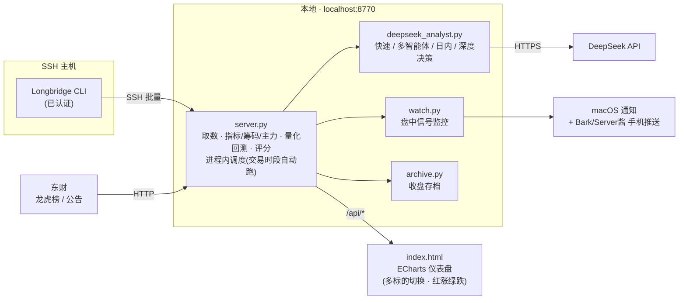
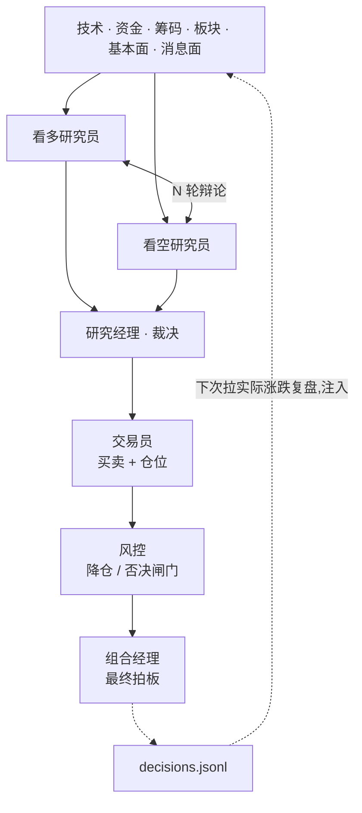

# 盘面 Tracker — A股/港股/美股 盘面分析 + DeepSeek 决策助手

一个**零依赖**(Python 标准库 + ECharts)的本地盘面分析平台。数据经 **Longbridge CLI** 拉取,
覆盖 A股 / 港股 / 美股;内置技术/资金/筹码/同板块/基本面多维分析、量化回测,
以及 **DeepSeek** 驱动的多模式研判(含 TradingAgents 式"多空辩论 → 交易员/风控/组合经理"决策链)。

> 单机、本地运行。所有个股/主机/密钥都通过配置文件注入,仓库本身不含任何具体标的或凭证。

## TL;DR
```bash
git clone https://github.com/gnawdrawoh/tradingassistantAshare.git && cd tradingassistantAshare
cp config.example.json config.json         # 填 ssh_host + 自选股
echo "sk-..." > .deepseek_key              # (可选) DeepSeek key,启用 AI 研判
./run.sh start                             # → http://localhost:8770
```
前提:一台你能 `ssh` 到、且装好并认证了 **Longbridge CLI** 的主机。

## 架构


**深度决策管线**(参考 TradingAgents,原生实现):


## 功能面板
- **行情/技术**:日K / 15分K / 分时(含均价线);MA · MACD · KDJ · RSI · BOLL;量能(红涨绿跌)
- **主力资金 / 筹码分布**:大中小单净额 + 分时资金流;成本分布(带换手衰减)+ 获利比例
- **同板块对比**:同业 + 大盘指数横向(距高/今日/两周半)
- **限售解禁 / 龙虎榜**(A股):`supply.json` + 东财龙虎榜(可选,无数据自动隐藏)
- **基本面**:`fundamentals.json`(营收/净利/现金流/分业务…,可选,无数据自动隐藏)
- **量化策略回测**:7 策略(均线/MACD/KDJ/布林/趋势/RSI反转/量价突破)胜率·收益·回撤·当前信号
- **AI 盘面研判 · DeepSeek**(4 模式):
  - **快速**:五维(技术/资金/筹码/板块/基本面)综合评级 + 信号
  - **多智能体**:5 位分析师各出观点 → 首席综合
  - **日内追踪**:读今日分时给日内做T信号(T+1 感知),可勾选盘中自动追踪
  - **深度决策**(TradingAgents 式):多空辩论(多轮)→ 研究经理裁决 → 交易员(仓位)→ 风控(闸门)
    → 组合经理拍板;含**消息面**(news+公告)与**反思记忆**(按实际涨跌复盘,越用越准)
- **盘中信号提醒**:规则类(免费)+ AI 类 → macOS 通知 + 手机推送(Bark/Server酱/PushDeer/webhook)
- **收盘自动存档** · 进程内调度(交易时段自动跑,免 cron)

## 依赖
- **Python 3**(仅标准库,无需 pip install)
- **Longbridge CLI**,已认证,装在一台你能 SSH 到的主机上
  (`ssh <your-host> longbridge check` 应显示 token 有效)。见 https://open.longbridge.com
- (可选)**DeepSeek API key**——启用 AI 研判。https://platform.deepseek.com

## 配置(把 `*.example.json` 复制成同名去掉 `.example`)
```bash
cp config.example.json config.json          # 必填:ssh_host + 自选股 watchlist
cp peers.example.json  peers.json            # 可选:某标的的同业组
cp supply.example.json supply.json           # 可选:限售/解禁结构(A股)
cp fundamentals.example.json fundamentals.json  # 可选:财报关键指标
```
- **SSH 主机**:`config.json` 的 `ssh_host`,或环境变量 `LB_SSH_HOST`
- **DeepSeek key**:`echo "sk-..." > .deepseek_key`(或环境变量 `DEEPSEEK_API_KEY`)
- **手机推送**:`cp push.example.json push.json` 填入你的 Bark/Server酱 key
- 以上文件(config/peers/supply/fundamentals/push/.deepseek_key)均已 **gitignore**,不会外泄

## 运行
```bash
./run.sh start        # → http://localhost:8770
./run.sh status|restart|stop
```
顶部自选栏可切换/添加/移除标的(A股 `600519.SH` / 港股 `700.HK` / 美股 `AAPL.US`)。

## 模型 / 环境变量
| 变量 | 默认 | 说明 |
|---|---|---|
| `LB_SSH_HOST` | config.json 的 ssh_host | Longbridge CLI 所在主机 |
| `DEEPSEEK_API_KEY` | 读 `.deepseek_key` | DeepSeek key |
| `DEEPSEEK_MODEL` | `deepseek-reasoner` | 深度环节模型(快速/日内/首席/深度)|
| `DEEPSEEK_SUB_MODEL` | `deepseek-chat` | 分析师/辩论/交易员/风控(求快)|
| `MAX_DEBATE_ROUNDS` | `2` | 深度决策的多空辩论轮数 |

## 文件
| 文件 | 作用 |
|---|---|
| `server.py` | 零依赖后端:SSH 取数 + 指标/筹码/主力/量化/评分 + 全部 API |
| `deepseek_analyst.py` | DeepSeek 四模式研判 + 深度决策管线 + 反思记忆 |
| `watch.py` | 盘中信号监控(规则+AI)+ macOS/手机推送 |
| `archive.py` | 收盘快照存档 |
| `index.html` | 单页仪表盘(ECharts,暗色终端风,红涨绿跌)|
| `*.example.json` | 配置模板(复制去掉 `.example` 使用)|

## 说明
- **红涨绿跌**:遵循 A 股习惯(涨=红,跌=绿),与美股相反
- 面板/图表跟随当前标的;所有 API 支持 `?symbol=`
- 时区:接口返回 UTC,日内图表已转北京时间;交易时段判断按本机时区(默认视为北京时)
- 仅为盘面数据分析工具,**不构成任何投资建议**

## 致谢
DeepSeek 决策管线的"多空辩论 + 决策链 + 反思记忆"设计参考了
[TradingAgents](https://github.com/TauricResearch/TradingAgents)(原生实现,未引入 LangGraph)。
图表由 [Apache ECharts](https://echarts.apache.org) 渲染。

## License
[MIT](LICENSE) © 2026 Howard Wang — 仅为研究/教育用途的行情分析工具,不构成投资建议。
